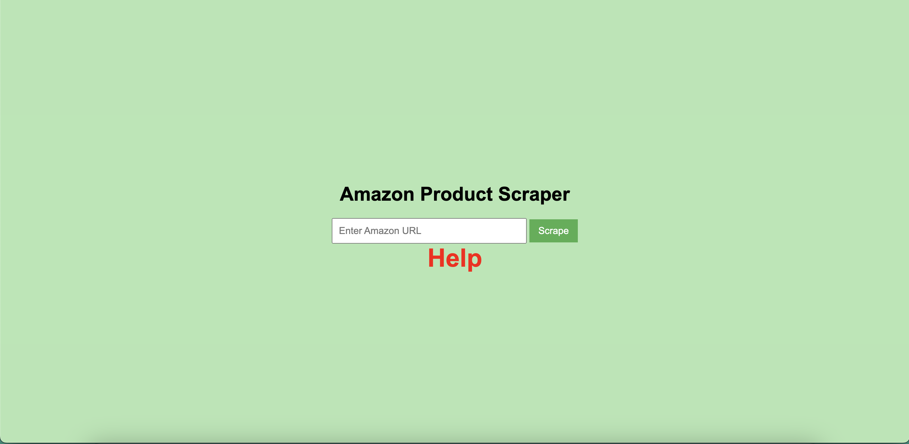
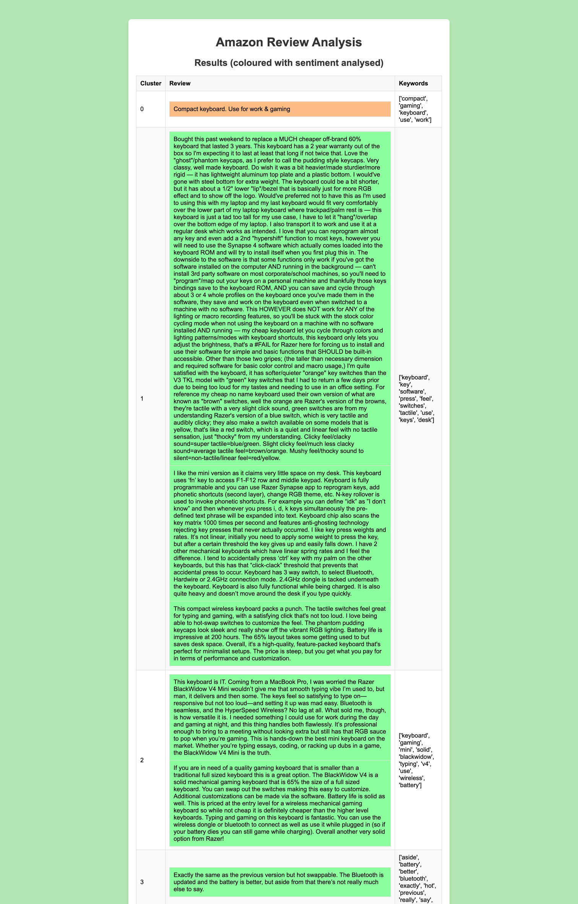

# Amazon Review Analysis

## Introduction
This project is about analyzing and clustering the Amazon reviews, helping users to read the desired reviews based on the keywords they are interested in. Also, users can discover the positive, negative, and neutral reviews. 

## Usage
After cloning the repository, install the required libraries using the command:
```pip install -r requirements.txt```

Run the application:
```Flask run```

## Main Page


Click on **Help** to get the instructions on how to use the application.


## Project Workflow

1. Review Extraction:
    * Extraction of reviews from the product's web page of Amazon.com.
2. Embedding Generation:
    * Generate embeddings for the reviews using OpenAI's `text-embedding-ada-002` model. 
3. Clustering:
    * Determine the optimal number of clusters using silhouette score.
    * Perform clustering using KMeans algorithm.
4. Keyword Extraction:
    * Apply a TF-IDF vectorizer to extract representative keywords for each cluster.
5. Sentiment Analysis:
    * Perform sentiment analysis on the reviews, classifying them as positive, negative, or neutral.

## Sample Result




